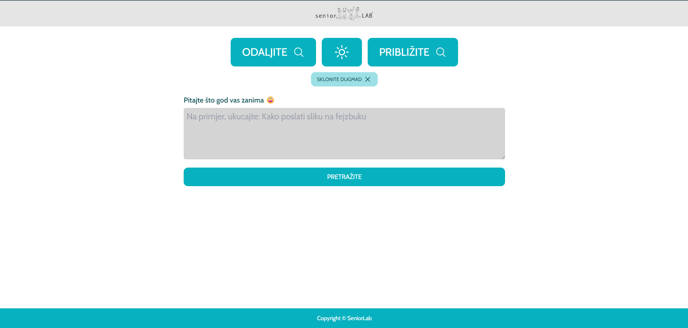
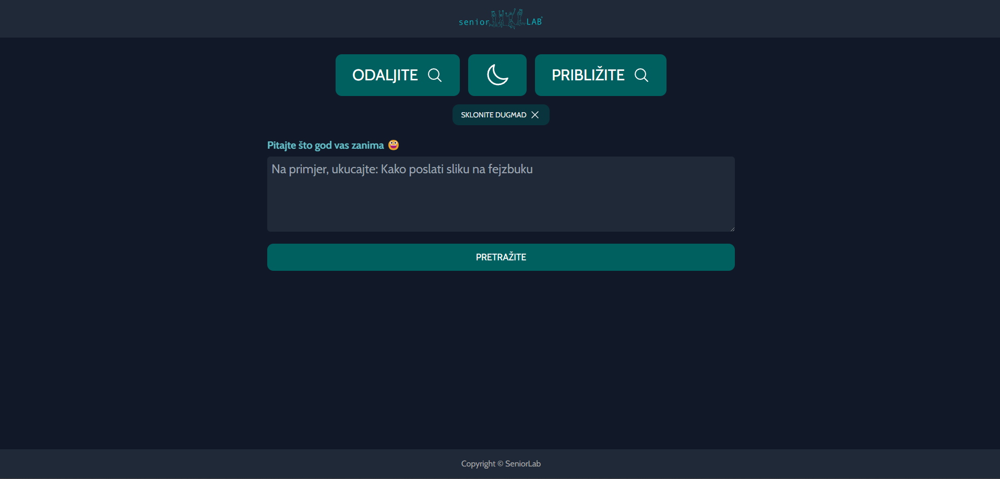

# SeniorLab AI: AI-Powered Accessibility Platform

You can see the app here: [Live](https://ai.seniorlab.ba/)

## Project Description
SeniorLab AI is an innovative platform designed to improve digital accessibility for senior citizens. Leveraging AI technology, the application provides a user-friendly interface with advanced search capabilities and accessibility features, empowering users over the age of 60 to navigate and interact with digital environments more effectively.

---

## Features
- **AI-Based Search**: Offers intuitive and accurate search results tailored to senior users.
- **Accessibility Options**: Includes text scaling, theme options, and other usability enhancements.
- **User-Friendly Interface**: Designed with simplicity and clarity to meet the needs of older users.
- **Resource Library**: Provides educational materials to help users improve their digital skills.

---

## Technologies Used
- **React**: For building a dynamic and responsive frontend.
- **AI Integration**: Powered by machine learning models for intelligent search.
- **Tailwind CSS**: For modern and efficient styling.
- **Supabase**: For database management and backend services.

---

## Setup Instructions
To run this project locally, follow these steps:

1. Clone the repository:

   ```bash
   git clone https://github.com/AndNijaz/SeniorLabAI.git
   ```

2. Navigate to the project directory:

   ```bash
   cd SeniorLabAI
   ```

3. Install dependencies:

   ```bash
   npm install
   ```

4. Start the development server:

   ```bash
   npm start
   ```

5. Open `http://localhost:3000` in your browser to view the application.

---

## Usage
The platform is designed for:
- **Senior Citizens**: Enabling easy access to digital tools and resources.
- **Educational Institutions**: Providing training materials for senior learners.
- **Healthcare Providers**: Assisting older patients in accessing digital healthcare resources.

---

## Screenshots

### Dashboard View



> *Screenshots are stored in the `/img` directory.*

---

## Project Status
This project is in the **development phase**. Future updates may include:
- Enhanced AI models for better search accuracy.
- Additional accessibility features such as voice commands.
- Expanded library of educational resources.

---

## Acknowledgements
This project is inspired by the vision of improving digital accessibility for senior citizens. Special thanks to collaborators and testers for their valuable feedback.

---

Just go to [here](http://132.226.195.28:9911/) and enjoy!
